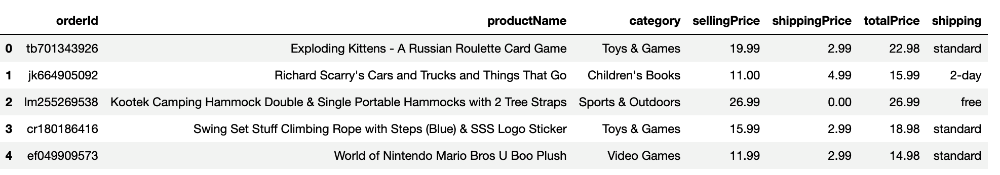

# Transform and Clean Online Orders

In this activity, you'll transform and clean a dataset that consists of online orders.

## Instructions

1. Create six columns from the one column that’s named “orderId,productName,category,sellingPrice,shipping,totalPrice”.

2. Create a new DataFrame with the six columns. To populate the columns, split the row values on the comma (',') delimiter.

3. Convert the "sellingPrice" and "totalPrice" columns to the `float` data type.

4. Calculate the shipping price of each product, and then add it to a new column named "shippingPrice".

5. Reorder the columns to match the final DataFrame, as the following image shows:

    

    In the preceding image, notice that the columns appear in the following order: “orderId”, “productName”, “category”, “sellingPrice”, “shippingPrice”, “totalPrice”, “shipping”.

## References

Data for this dataset was generated by edX Boot Camps LLC and is intended for educational purposes only.

- - -

© 2022 edX Boot Camps LLC. Confidential and Proprietary. All Rights Reserved.
