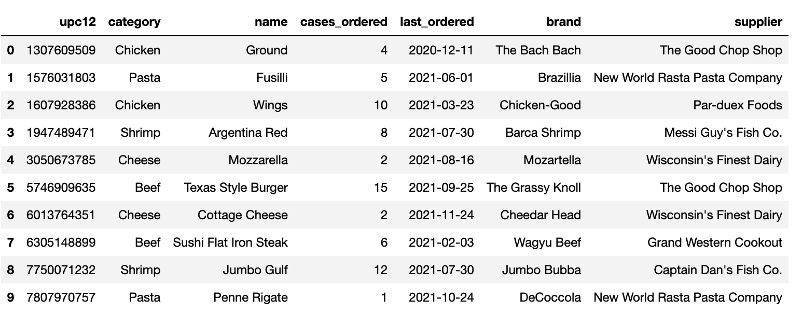

# Transform and Clean Grocery Orders

In this activity, you’ll transform and clean grocery order data and merge it with another dataset.

## Instructions

1. Note that by using the provided starter code, you'll read the `grocery_orders.xlsx` dataset into a new DataFrame, transform and clean the DataFrame to create a new DataFrame, and then merge the new DataFrame with the one created from the `grocery_suppliers.csv` dataset. The following image shows how the merged DataFrame should appear:

    

    In the preceding image, notice that the columns appear in the following order: "upc12", "category", "name", "cases_ordered", "last_ordered", "brand", "supplier".

2. To do so, complete the following steps:

    * Read the `grocery_orders.xlsx` file into a DataFrame.

    * Create a new DataFrame by splitting the data in the single column on the `','` delimiter into four columns.

    * Convert the "upc12" column to an integer.

    * Convert the "cases_ordered" column to an integer.

    * Convert the "last_ordered" column from `UTC` to a date.

    * Split the "item_name" column into two columns: one with the category and the other with the item type.

    * Drop the "item_name" column, and reorder the columns.

    * Read the `grocery_suppliers.csv` data into a DataFrame, check that the data types in both DataFrames match, and then merge the two DataFrames.

## References

Data for this dataset was generated by edX Boot Camps LLC and is intended for educational purposes only.

---

© 2022 edX Boot Camps LLC. Confidential and Proprietary. All Rights Reserved.