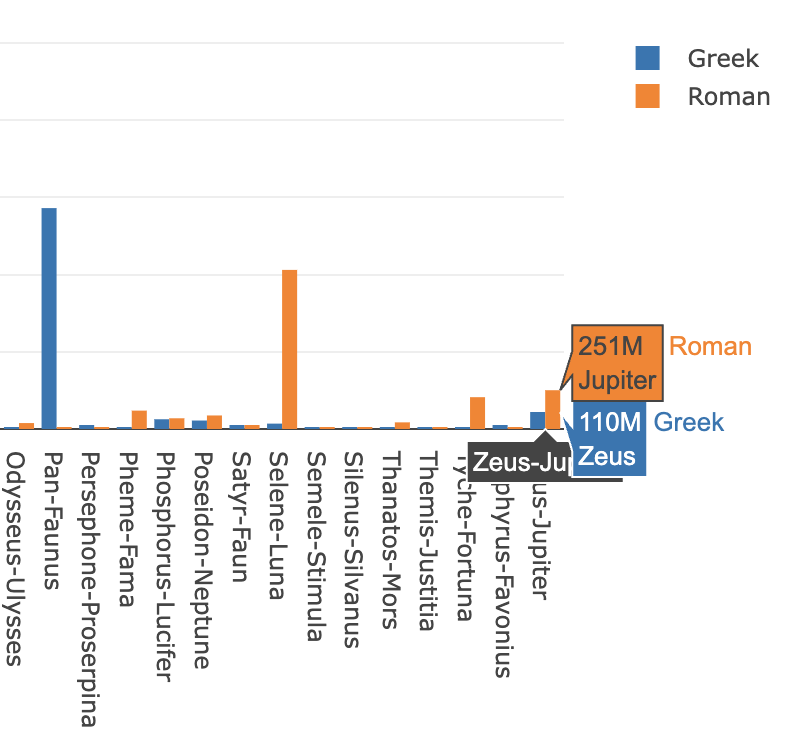

# Greek vs. Roman Mythology

In this activity, you will compare search results between Greek and Roman mythology to determine whether the Greek or Roman name for the god is more popular.

## Instructions

Ancient Roman gods were often counterparts to or imports of Greek gods. For example, the Greek god Zeus became the Roman god Jupiter through an etymological transformation from Zeus to Zeus Pater ("Father Zeus") to Jupiter. (Classical Latin lacked a "J" consonant.)

In today's world, are these gods better known by their Roman names or Greek names?

Your task is to plot the number of search results for both Roman and Greek names, returned for each god, which will visually answer the previous question. To do so, follow these steps:

* Examine the data in [data.js](Unsolved/data.js). Note the names of properties in each data object.

  * To accomplish this task, you will need to create two traces, one for Roman gods, and another for Greek gods. You may use the starter file [plots.js](Unsolved/plots.js) for this.

* To define the data for each plot point in a trace, use a `for` loop on the dataset. For each trace:

  * For the x-axis, provide an array of the paired string of Greek and Roman god names, e.g., Amphitrite-Salacia.

  * For the y-axis, provide an array of search results for Greek and Roman god names in their separate traces.

* Open [index.html](Unsolved/index.html) in Chrome to view your plot.

## Reference

Search results figures retrieved on December 1, 2021 from https://www.google.com.

---

© 2022 edX Boot Camps LLC. Confidential and Proprietary. All Rights Reserved.
