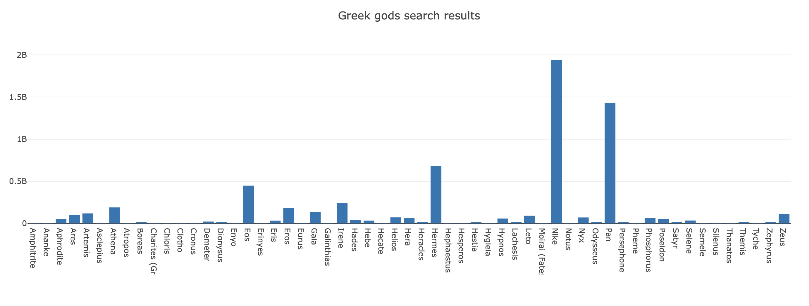

# Mapping with Plotly

In this activity, you will create an array of Greek god search results using the `map` function with the [data.js](Unsolved/data.js) dataset.

## Instructions

* You may use the starter files `index.html` and `plots.js` provided in the [Unsolved](Unsolved) folder.

* Create an array of Greek god names from the [data.js](Unsolved/data.js) dataset.

* Create an array of Greek god search results from the [data.js](Unsolved/data.js) dataset.

* Create a Plotly bar chart with names on the x-axis and search results on the y-axis, like this:

* Include a title on the plot.

## Hint

Open the console to see the dataset stored in the variable `data`.

## Reference

Search results retrieved on December 1, 2021 from https://www.google.com.

---

© 2022 edX Boot Camps LLC. Confidential and Proprietary. All Rights Reserved.
