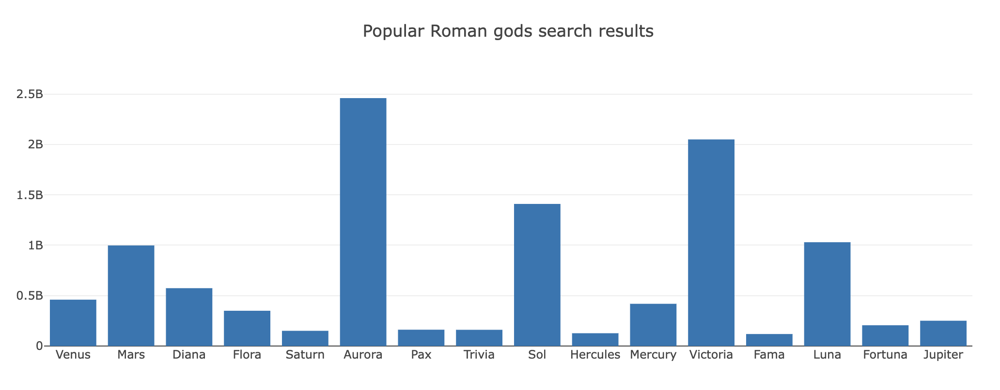

# Filtering with Plotly

In this activity, you will create an array of popular Roman god search results by using the `filter` function with the [data.js](Unsolved/data.js) dataset.

## Instructions

* You may use the starter files `index.html` and `plots.js` provided in the [Unsolved](Unsolved) folder.

* Create a custom function to return Roman gods with more than 100 million search results.

* Create an array of Roman god names from the filtered data.

* Create an array of Roman god search results from the filtered data.

* Create a Plotly bar chart with names on the x-axis and search results on the y-axis. For example:

## Hint

Open the console to see the dataset stored in the variable `data`.

## Reference

Search results retrieved on December 1, 2021 from https://www.google.com.

---

© 2022 edX Boot Camps LLC. Confidential and Proprietary. All Rights Reserved.
