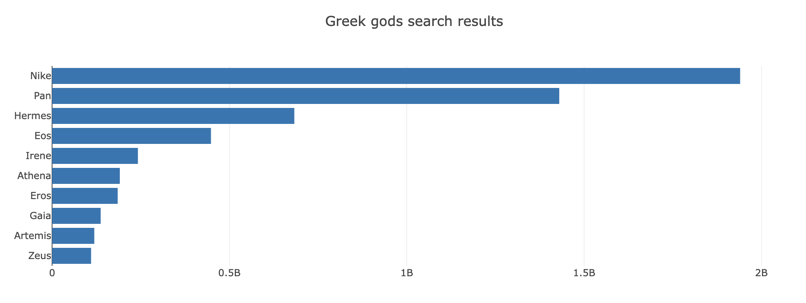

# Sorting and Slicing with Plotly

In this activity, you will sort, slice, and reverse the [data.js](Unsolved/data.js) dataset to build a horizontal bar chart of the top 10 Greek god search results.

## Instructions

* You may use the starter files `index.html` and `plots.js` provided in the [Unsolved](Unsolved) folder.

* Sort the data by Greek search results in descending order.

* Slice the first 10 objects of the array for the plot.

* Reverse the array to compensate for Plotly's horizontal bar chart defaults.

* Create a Plotly bar chart with names on the x-axis and search results on the y-axis. For example:

## Hint

Review the [Plotly documentation](https://plotly.com/javascript/horizontal-bar-charts/) to research how to make a bar chart horizontal.

## Reference

Search results retrieved on December 1, 2021 from https://www.google.com.

---

© 2022 edX Boot Camps LLC. Confidential and Proprietary. All Rights Reserved.
