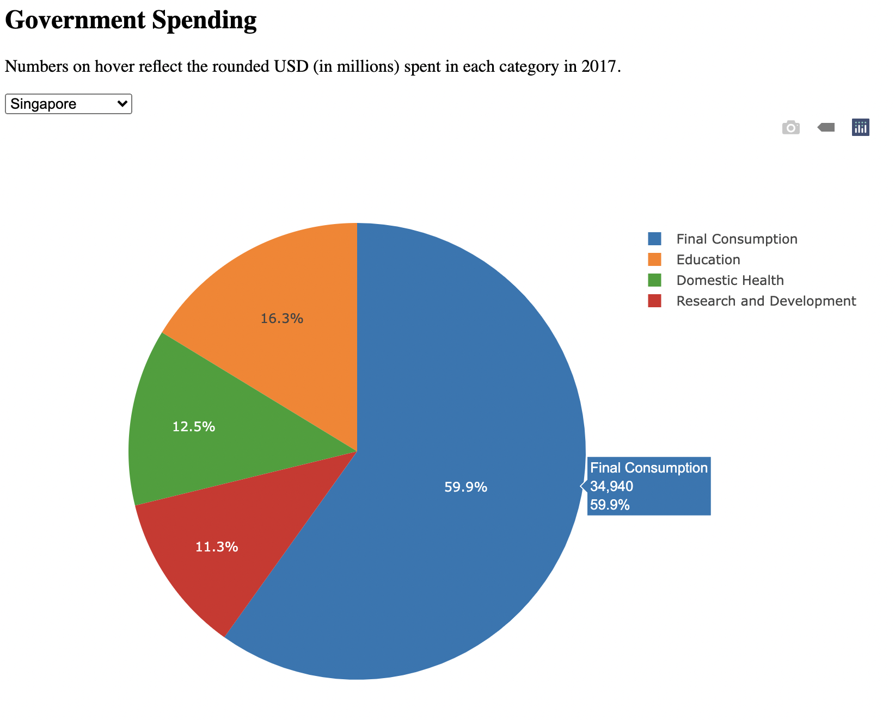

# Government Expenditure

In this activity, you will create a dynamic pie chart using Plotly that displays 2017 data on select categories of government spending.

## Instructions

* You may use the starter files `index.html` and `plots.js` provided in the [Unsolved](Unsolved) folder.

* Using the data in `data.js`, create a pie chart that meets the following criteria:

  * Displays a default dataset.

  * Contains a dropdown menu listing six countries: Australia, Brazil, United Kingdom, Mexico, Singapore, and South Africa.

  * When we select an option from the dropdown menu, our code should retyle the chart to reflect the new data.

  * See the following image for reference.

    

## Hint

* Log the provided variables to the console to determine their use in creating the trace object.

* For information about creating pie charts with Plotly, refer to the [Plotly documentation](https://plotly.com/javascript/pie-charts/).

## References

World Bank national accounts data, and OECD National Accounts data files (2021). General government final consumption expenditure (% of GDP). https://data.worldbank.org/indicator/NE.CON.GOVT.ZS

World Health Organization Global Health Expenditure database (apps.who.int/nha/database) via The World Bank (2021). Domestic general government health expenditure (% of GDP). https://data.worldbank.org/indicator/SH.XPD.GHED.GD.ZS

UNESCO Institute for Statistics (uis.unesco.org) via The World Bank (2021). Government expenditure on education, total (% of GDP). https://data.worldbank.org/indicator/SE.XPD.TOTL.GD.ZS

UNESCO Institute for Statistics (uis.unesco.org) via The World Bank (2021). Research and development expenditure. https://data.worldbank.org/indicator/GB.XPD.RSDV.GD.ZS

World Bank national accounts data, and OECD National Accounts data files (2021). GDP (current US$). https://data.worldbank.org/indicator/NY.GDP.MKTP.CD

---

© 2022 edX Boot Camps LLC. Confidential and Proprietary. All Rights Reserved.
