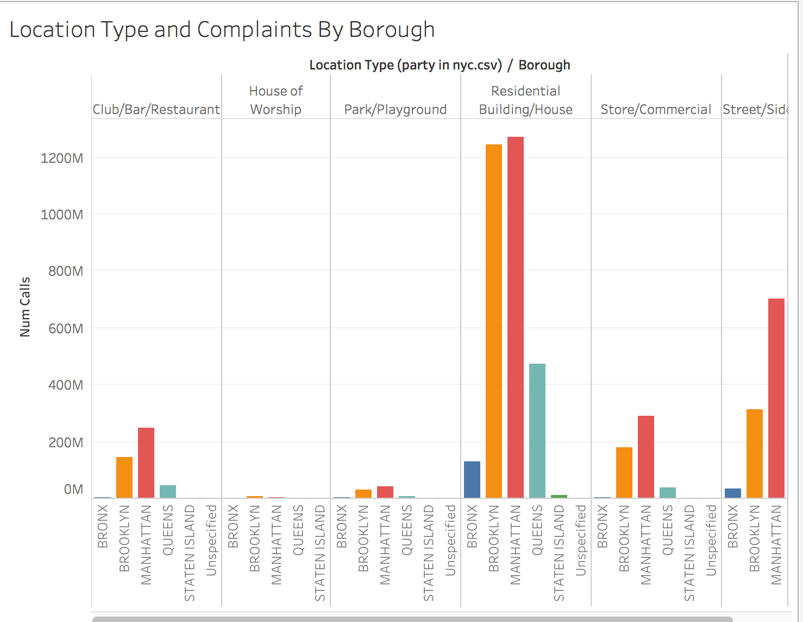

# Most Fun Neighborhood in NYC?

In this activity, you’ll find the “most fun” neighborhoods in New York City by mapping bars that have received the highest number of noise complaints.

## Instructions

**Part 1**

* Use the provided dataset to create a map of NYC bars, broken down by boroughs.

  * It should show the locations of bars that have been subject to noise complaints.

  * A bar should be proportionately represented by the number of complaints it has received.

  * A bar should also reflect the borough in which it is located.

  * Each zip code in the city should be displayed on the map, as in the following image. Location is everything!

  

**Part 2**

* Create a bar chart that breaks down, per borough, the type of building versus the number of complaints received, as in the following image:

  

**Part 3**

* Create a dashboard of the worksheets you just created. If you finish early, feel free to create a few more interesting visualizations!

## References

New York City. (2017). 311 Service Requests 2012-2017. [https://data.cityofnewyork.us/Social-Services/311-Service-Requests-from-2010-to-Present/erm2-nwe9](https://data.cityofnewyork.us/Social-Services/311-Service-Requests-from-2010-to-Present/erm2-nwe9)

---

© 2022 edX Boot Camps LLC. Confidential and Proprietary. All Rights Reserved.
