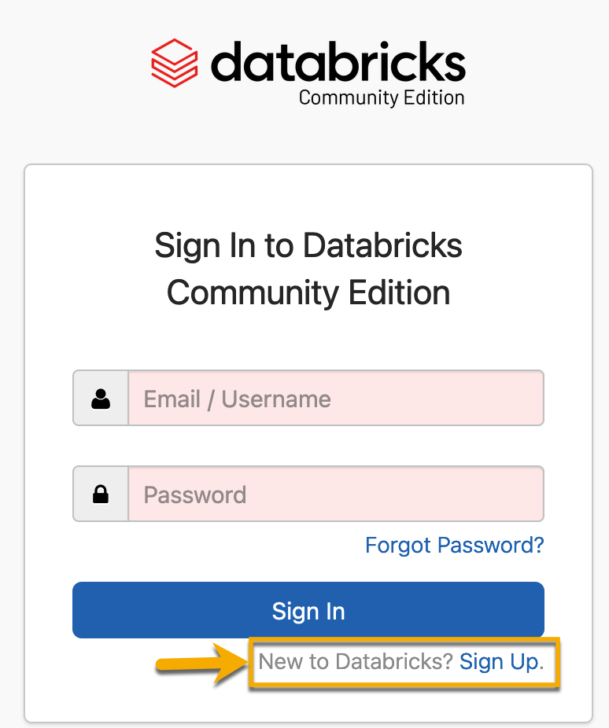
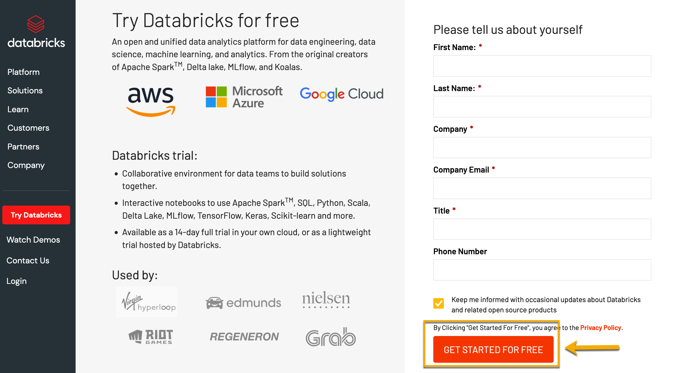
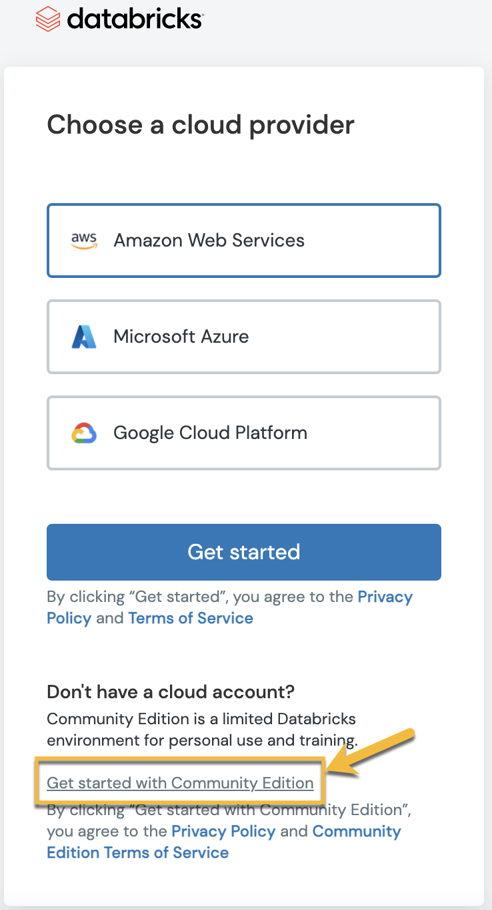
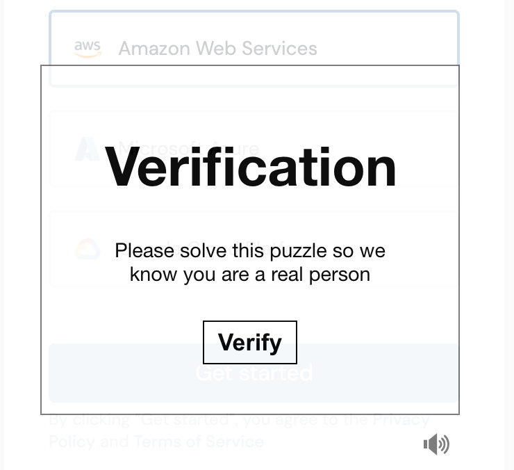
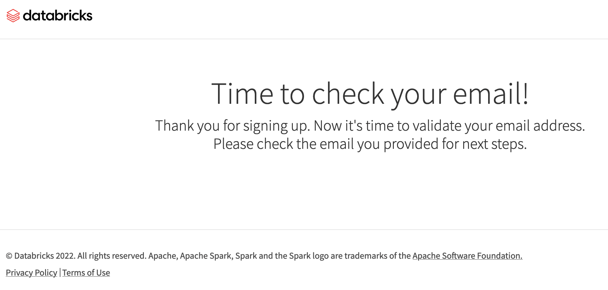
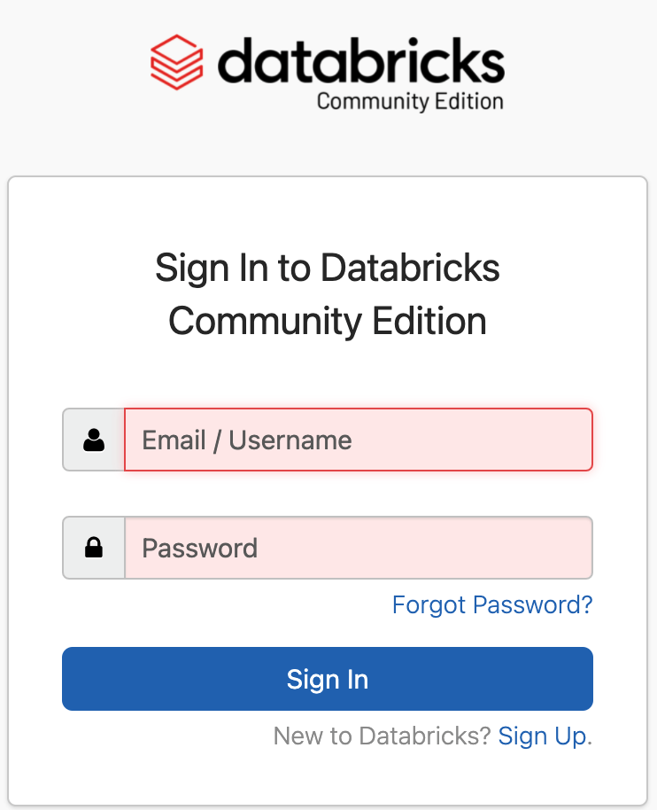

# Get Started with Databricks

In this activity, you will sign up for a Databricks Community Edition account.

### Instructions

1. Open the following link to sign up for a [Community Edition account](https://community.cloud.databricks.com/login.html). If you don't have an account, then click "Sign Up", which will open a new webpage.

    

2. On the next page, fill out the required information and click "Get Started For Free."

    

3. You will be redirected to signing up for the standard databricks account. **DO NOT click any of the cloud provider options.** To use the Community Edition, click on "Get started with Community Edition."

    

4. Next, you will be asked to go through a verification process before you are able to use the Community Edition.

    

5. Once you complete the process, you'll get a notice to check your email.

    

6. Click on the link to verify your email address. You'll be asked to reset your password. Create a new password, and then log in to the Community Edition using your new password.

    

Explore the Databricks landing page.

## Bonus

Use the documentation provided or the quick start tutorial to create a Databricks cluster.

---

© 2022 edX Boot Camps LLC. Confidential and Proprietary. All Rights Reserved.
