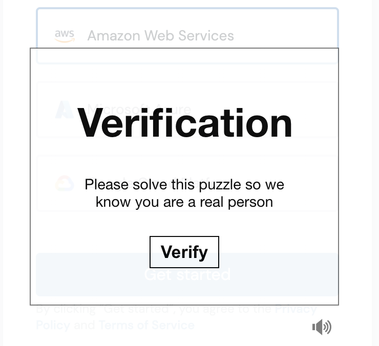
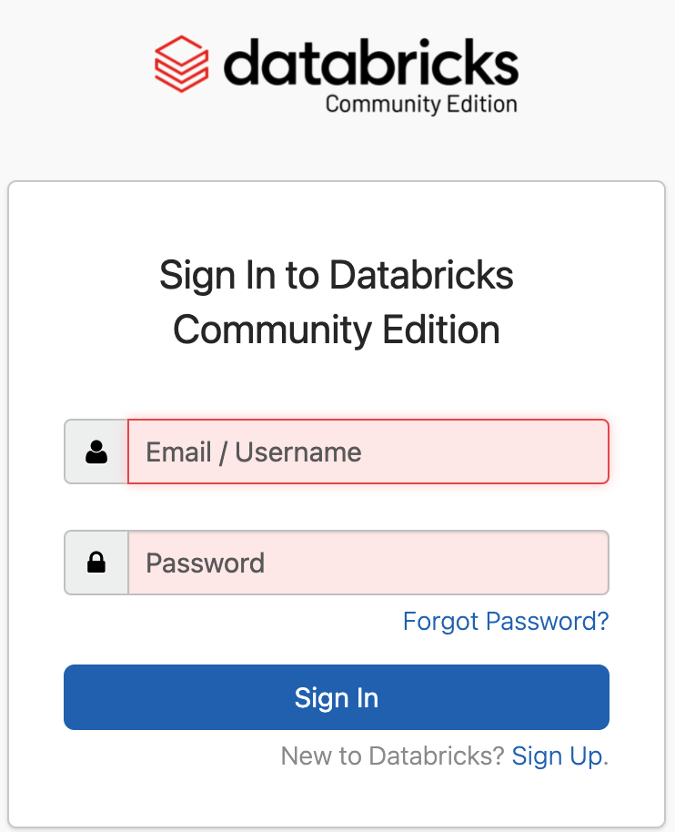

# Databricks Community Edition

## Creating an Account

* Open the following link to signup for a [Community Edition account](https://community.cloud.databricks.com/login.html).If you don't have an account, then click on "Signup", which will open a new webpage.

    

* On the next page, fill out the required information and click "Get Started For Free."

    

* You will be redirected to signing up for the standard Databricks account. **DO NOT click any of the cloud provider options.** To use the Community Edition click on "Get started with Community Edition."

    

* Next, you will be asked to go through a verification process before you are able to use the Community Edition.

    

* Once you verify your account you'll get a notice to check your email.

    

* Click on the link to verify your email address. Then, you'll be asked to reset your password. Once you reset your password you will be able to log into the Community Edition.

    

## Getting Started with the Community Edition

* Once you have logged into your Databricks Community Edition account you'll see the Data Science and Engineering landing page.

    

* On the landing page there are four options to choose from:
    * A quick start tutorial to help you create a cluster, attach a notebook to your cluster, create a table for a dataset, query the table using SQL, create a table and a graph, and create a DataFrame.
    * Create a new notebook, like a Jupyter Notebook.
    * Import data
    * Connect to external software, like Tableau, Power BI and many more. **Note:** the Community Edition does not allow connections to external software.

* You can use the quick start tutorial to get familiar with Databricks, or you can use the following steps to get started.

    * Before you create a notebook you have to create a cluster. On the navigation pane on the left side of the landing page, click on the the "+" and select "Cluster".

        

    * You may use the default runtime settings, `9.1 LTS (Scala 2.12, Spark 3.1.2)`, or select an alternate version.

         

    * Next, enter a name for your cluster.

        

    * Once you provide a name for your cluster click "Create Cluster" button at the top of the "Create Cluster" page.

        

    * After you click "Create Cluster" a progress circle icon will spin while the cluster is being created. This may take a few minutes.

        

---

© 2022 edX Boot Camps LLC. Confidential and Proprietary. All Rights Reserved.
